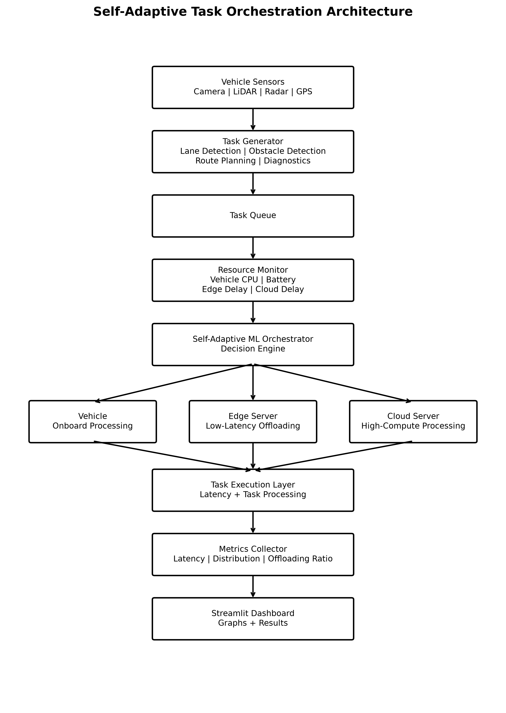
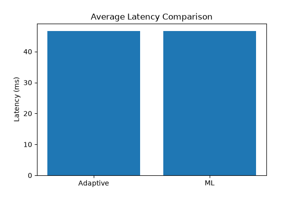
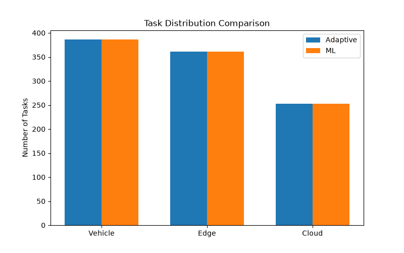
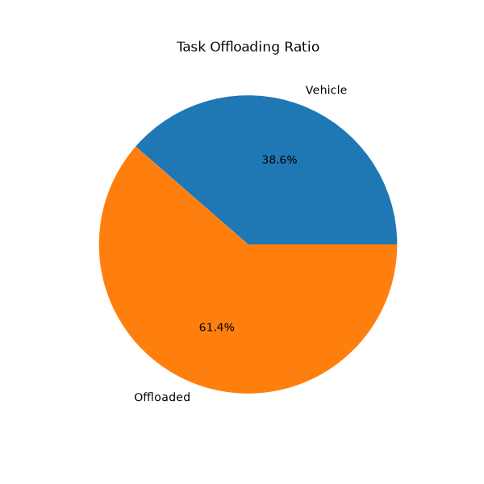

# 🚗 Self-Adaptive Task Orchestration for the Automotive Edge–Cloud Continuum

## 📌 Overview

Modern autonomous vehicles generate thousands of computational tasks every second. These tasks vary in urgency, resource requirements, and latency constraints.

Processing every task onboard increases computational load, while sending everything to the cloud introduces network latency. This project proposes a **Self-Adaptive Task Orchestration Framework** that dynamically decides where tasks should execute:

- 🚗 Vehicle (Onboard)
- 📡 Edge Server
- ☁️ Cloud Server

The goal is to optimize:

- Latency
- Resource Utilization
- Task Completion Rate
- System Efficiency

---

## 🎯 Problem Statement

Autonomous vehicles continuously perform operations such as:

- Lane Detection
- Obstacle Detection
- Traffic Sign Recognition
- Route Planning
- Vehicle Diagnostics

Different tasks have different latency requirements.

A fixed execution strategy is inefficient because:

- Processing everything onboard overloads the vehicle.
- Processing everything in the cloud introduces delays.
- Static approaches cannot adapt to changing conditions.

This project introduces an adaptive orchestration framework that dynamically selects the best execution environment.

---

## 🏗️ System Architecture


  Vehicle Sensors
        │
        ▼
  Task Generator
        │
        ▼
    Task Queue
        │
        ▼
 Resource Monitor
        │
        ▼
 ML Orchestrator
         │
 ┌───────┼──────┐
 │       │      │
 ▼       ▼      ▼
Vehicle Edge  Cloud
         │
         ▼
Execution Simulator
         │
         ▼
Metrics Collector
         │
         ▼
Dashboard
```

---

## ⚙️ Features

### Task Generation

Generates automotive workloads:

- Lane Detection
- Obstacle Detection
- Traffic Sign Recognition
- Route Planning
- Vehicle Diagnostics

### Resource Monitoring

Monitors:

- Vehicle CPU Usage
- Vehicle Battery Level
- Edge Network Delay
- Cloud Network Delay

### Adaptive Decision Engine

Makes execution decisions based on:

- Latency Requirements
- CPU Usage
- Battery Levels
- Network Conditions

### Machine Learning Orchestrator

Uses a Decision Tree Classifier to predict:

- VEHICLE
- EDGE
- CLOUD

execution targets.

### Performance Evaluation

Measures:

- Average Latency
- Task Distribution
- Offloading Ratio

### Interactive Dashboard

Built using Streamlit.

---

## 🛠️ Technology Stack

### Programming

- Python

### Data Processing

- Pandas
- NumPy

### Machine Learning

- Scikit-Learn

### Visualization

- Matplotlib

### Dashboard

- Streamlit

### Version Control

- Git
- GitHub

---

## 📊 Results

### Average Latency

| Strategy              | Average Latency |
|-----------------------|-----------------|
| Adaptive Orchestrator | 46.65 ms        |
| ML Orchestrator       | 46.69 ms        |

### Task Distribution

| Execution Location | Tasks |
|--------------------|-------|
| Vehicle            | 386   |
| Edge               | 361   |
| Cloud              | 253   |

### Offloading Ratio

- Local Processing: 38.6%
- Offloaded Processing: 61.4%

---

## 📈 Generated Visualizations

- Average Latency Comparison
- Task Distribution Comparison
- Offloading Ratio

---

## 🚀 How to Run

### Install Dependencies

```bash
pip install -r requirements.txt
```

### Run Main Simulation

```bash
python main.py
```

### Train ML Model

```bash
python src/train_model.py
```

### Run Dashboard

```bash
streamlit run dashboard/app.py
```

---

## 📂 Project Structure


automotive-edge-cloud-orchestration/
│
├── data/
├── dashboard/
├── docs/
├── src/
├── tests/
│
├── README.md
├── requirements.txt
└── main.py


---

## 🏗️ Architecture Diagram

]

## 📈 Visualization Outputs

### Average Latency Comparison


### Task Distribution Comparison


### Offloading Ratio


## 🎓 Learning Outcomes

This project demonstrates:

- Edge Computing
- Cloud Computing
- Task Offloading
- Resource Scheduling
- Machine Learning
- Performance Evaluation
- Dashboard Development

---

## 👩‍💻 Author

**Vaishnavi Senthilkumar**

Computer Science Student | AI & Software Development Enthusiast

LinkedIn:
https://www.linkedin.com/in/vaishnavi-senthil-kumar-477262305/

---

## ⭐ Future Enhancements

- Reinforcement Learning-Based Orchestration
- Real-Time Edge Deployment
- SUMO Traffic Simulation Integration
- Docker-Based Deployment
- Kubernetes-Based Orchestration
